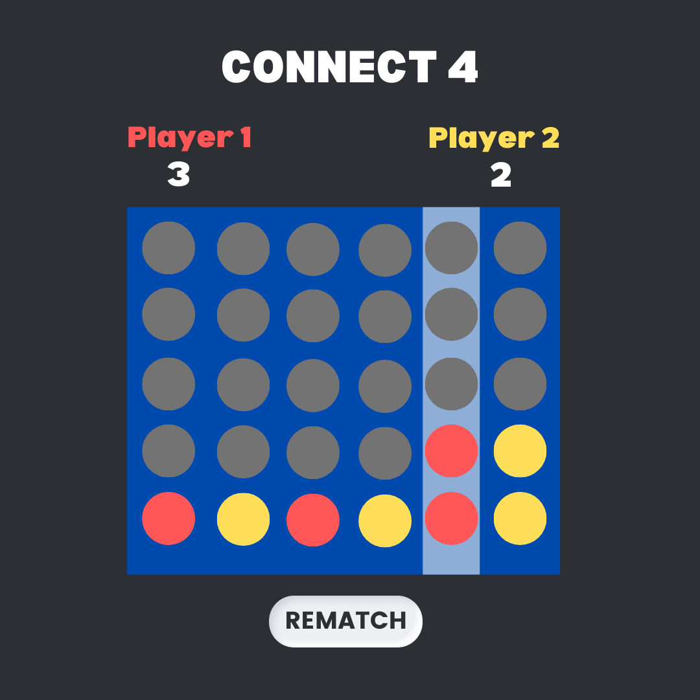

# Let's play <i>Connect Four</i>

## Wireframe

## Objective 

<i>Connect Four</i> is a two-player connection board game, in which players choose a colour (yellow or red) take turns "dropping" a "disc" into a seven column, six-row vertical grid. The pieces fall straight down, occupying the lowest available space within the column.The objective of the game is to be the first to form a horizontal, vertical, or diagonal line of four of one's "discs". 

To learn more <a href="https://en.wikipedia.org/wiki/Connect_Four"> <b>Read Here</b></a>

## Pseudocode 

Human Player vs Human Player 

1. Define required constants 
   1. Define a colour object with keys of 'null' (when the circle is empty)
   2. Define players, player 1 and player 2
   3. Define the possible winning cominations, and containing four indexes of the board that make a winner if they hold the same player value

2. Create game board
   1. Create a 5x6 board game 
      1. set "board" to empty 
      2. Animation to hover which column you're in
      3. Add bounce animation in css 
   
3. Placing pieces on board 
   1. Use a turn variable to remeber whose turn it is
   2. Use local storage* to ensure pieces stay on the board 
   3. Use a winner variable to represent three different possibilities - player that won, lose, or tie
   4. Check for win 
      1. iterate through every position on the board for all possible connected entries in different directions 
      2. Calculate winner without winning cominbination, check:
         1. Horizontal 
         2. Verticle 
         3. Diagonal up right 
         4. Diagonal up left 
   
   5. Check for tie
   
   6. Switch players 
      1. Player 1 alternating with Player 2

4. End game 
   1. pop up alert message: winner

5. Create Restart button 

